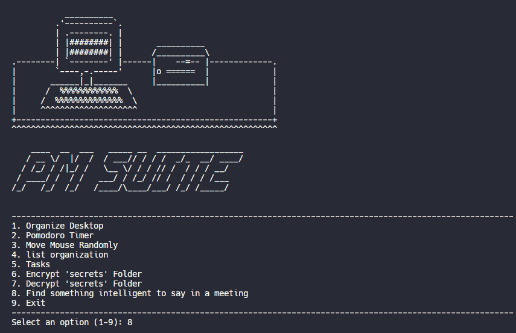

# PM SUITE

The best solution ingenieros for engineers who need to pretend to work.

### TODO

- [x] Initial prototype menu
- [x] Pomodoro timer
- [ ] Random engineering jargon
- [ ] Unix friendly
- [ ] Much more...

## LICENSE

  "THE BEER-WARE LICENSE" (Revision 42):
  <phk@FreeBSD.ORG> wrote this file.  As long as you retain this notice you
  can do whatever you want with this stuff. If we meet some day, and you think
  this stuff is worth it, you can buy us a beer in return. 
 
    
 