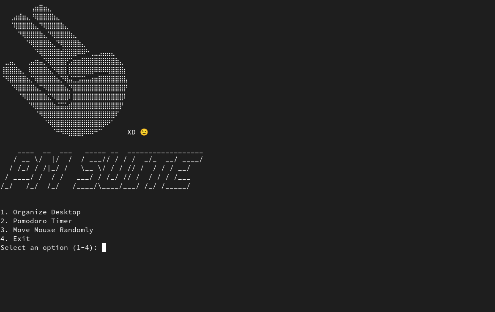

  # PM Suite - Project Management for the Clueless PMs 🤔💼

Welcome to PM Suite, the ultimate project management solution for Project Managers who don't want to manage projects or simply have no idea how to do it!

<hr>



<hr>


## Features

1. **Organize Desktop:**
   - Keep your desktop clutter-free by categorizing files into folders based on their types.

2. **Pomodoro Timer:**
   - Boost your productivity with the Pomodoro timer. Set the timer, focus on your task, and receive notifications when it's time to take a break.

3. **Move Mouse Randomly:**
   - Prevent your computer from going to sleep by moving the mouse randomly every 20 seconds. Use a shortcut to stop it anytime.

4. **List Organization:**
   - View the contents of the organization folder to see how well your desktop has been organized.

5. **Tasks:**
   - Manage your tasks by adding, removing, and updating tasks in a simple JSON file. Stay organized and on top of your to-do list.

6. **Encrypt 'secrets' Folder:**
   - Securely encrypt the 'secrets' folder within the organization directory using the Fernet encryption algorithm. The encryption key is stored within the organization folder.

7. **Decrypt 'secrets' Folder:**
   - Decrypt the 'secrets' folder using the stored encryption key. Simply provide the path to the key, and your secrets will be accessible again.

8. **Find Something Intelligent:**
   - Need an intelligent comment for a meeting? Let PM Suite generate a thoughtful sentence for you.

9. **Need an excuse? Project delay?**
   - Don't panic! we got your back, best excuses generated by an evil AI will be at your disposal by clicking option number 9.

### TODO

- [x] Initial prototype menu
- [x] Pomodoro timer
- [x] Random engineering jargon
- [x] Link the task to the pomodoro timer, time spent on a task will be added to the task.
- [x] Excuses generator baby!
- [x] Encrypt and decrypt secrets folder
- [x] Organize desktop
- [x] List organization
- [x] Simple Notepad
- [ ] Add a GUI
- [ ] Unix friendly
- [ ] Much more...

<hr>

## Requirements

Make sure you have Python installed on your system. Use the following commands to install the required dependencies:

## Getting Started

1. Clone the repository
```bash
git clone https://github.com/guillermodean/pmsuite.git
cd pmsuite
```
2. Install the required dependencies:

```bash
pip install -r requirements.txt
```
To get started, just blindly run the `main.py` script and let PM Suite take control. Don't worry; you're in capable (sort of) hands.

```bash
python main.py
```

### Economic Support

If you find yourself overwhelmed by the sheer brilliance of PM Suite, and you want to contribute to the caffeine-fueled development, consider buying us a virtual coffee:

[](https://www.buymeacoffee.com/guillermodf)

## Contributions

Contributions are always welcome! If you have brilliant (or not-so-brilliant) ideas to make PM Suite even more confusing, feel free to open an issue or submit a pull request. We accept contributions in the form of memes too!

Now, go forth, fellow PM, and conquer the world with the power of PM Suite! 🚀😄

**Contributors:**

[](https://github.com/0xRauros)
[](https://github.com/angelsolaorbaiceta)


## LICENSE

  "THE BEER-WARE LICENSE" (Revision 42):
  <phk@FreeBSD.ORG> wrote this file.  As long as you retain this notice you
  can do whatever you want with this stuff. If we meet some day, and you think
  this stuff is worth it, you can buy us a beer in return. 


 
    
 
